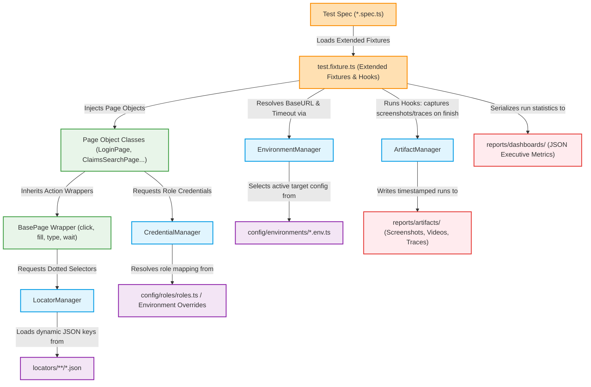

# Playwright Claims Framework - Architectural Design & Implementation Guide

This document details the architectural layers, execution flows, and component layouts of the **Majesco Claims E2E Automation Framework**. It provides a comprehensive roadmap of the files, directories, managers, and fixtures, complete with concrete code and configuration examples to serve as an onboarding and development reference.

---

## 1. Runtime Dependency and Execution Flow Diagram

The following diagram illustrates the interaction between test scripts, fixtures, Page Object Models (POM), configurations, externalized locators, and dynamic managers during a test execution lifecycle:



### Detailed Execution Lifecycle Flow

1. **Invocation**: A test run is started via CLI (`npm run test:...`) or CI pipeline. Playwright loads the configuration in [playwright.config.ts](file:///c:/Users/Aerva910894/OneDrive%20-%20Majesco/Desktop/Sudheer/Playwright/Claims_USIC_Playwright/playwright.config.ts).
2. **Environment & Framework Init**: [playwright.config.ts](file:///c:/Users/Aerva910894/OneDrive%20-%20Majesco/Desktop/Sudheer/Playwright/Claims_USIC_Playwright/playwright.config.ts) resolves variables, triggers the dynamic [EnvironmentManager](file:///c:/Users/Aerva910894/OneDrive%20-%20Majesco/Desktop/Sudheer/Playwright/Claims_USIC_Playwright/src/managers/EnvironmentManager.ts), and determines the target URL, timeouts, and report directories.
3. **Fixture Injection**: When a `*.spec.ts` file begins execution, it relies on [test.fixture.ts](file:///c:/Users/Aerva910894/OneDrive%20-%20Majesco/Desktop/Sudheer/Playwright/Claims_USIC_Playwright/src/fixtures/test.fixture.ts) which instantiates required POM classes and intercepts console errors.
4. **Credential Resolution**: When navigating or signing in, the POM calls [CredentialManager](file:///c:/Users/Aerva910894/OneDrive%20-%20Majesco/Desktop/Sudheer/Playwright/Claims_USIC_Playwright/src/managers/CredentialManager.ts) to retrieve the appropriate role username and password, checking for active environment variables (e.g. `QA_ADMIN_USERNAME`) before using fallback constants.
5. **Selector Resolution**: POM classes call actions (like `click('login.loginButton')`). [BasePage](file:///c:/Users/Aerva910894/OneDrive%20-%20Majesco/Desktop/Sudheer/Playwright/Claims_USIC_Playwright/src/base/BasePage.ts) routes the query to [LocatorManager](file:///c:/Users/Aerva910894/OneDrive%20-%20Majesco/Desktop/Sudheer/Playwright/Claims_USIC_Playwright/src/managers/LocatorManager.ts), which queries the JSON mapping database, resolving dot-separated paths into raw CSS/XPath selectors.
6. **Interaction**: Playwright drives the browser page using robust, auto-waiting wrappers implemented inside [BasePage](file:///c:/Users/Aerva910894/OneDrive%20-%20Majesco/Desktop/Sudheer/Playwright/Claims_USIC_Playwright/src/base/BasePage.ts).
7. **Lifecycle Teardown & Reporting**: After test completion (or upon failure), the custom hooks in [test.fixture.ts](file:///c:/Users/Aerva910894/OneDrive%20-%20Majesco/Desktop/Sudheer/Playwright/Claims_USIC_Playwright/src/fixtures/test.fixture.ts) trigger. [ArtifactManager](file:///c:/Users/Aerva910894/OneDrive%20-%20Majesco/Desktop/Sudheer/Playwright/Claims_USIC_Playwright/src/managers/ArtifactManager.ts) captures full-page screenshots, copies videos, traces, and formats test-run logs into target directories. A metadata JSON file is generated for summary reporting.

---

## 2. Framework Folder Architecture Diagram

The folder structure is organized to cleanly separate configuration, selector maps, page actions, automation fixtures, utilities, specs, operational scripts, and execution reports.

```text
Claims_USIC_Playwright/ (Project Root)
├── .github/
│   └── workflows/
│       └── playwright.yml         # GitHub Actions CI Workflow - Orchestrates parallel execution across dynamic environments
├── Jenkinsfile                    # Jenkins CI/CD Pipeline - Scripted pipeline integrating stages for setup, execution, and dashboard rendering
├── config/                        # Configuration Layer - Environment values, credential definitions, and framework parameters
│   ├── environments/              # AppEnvironment structures mapping target environments to URLs and settings
│   │   ├── dev.env.ts             # DEV environment properties (timeouts, URL)
│   │   ├── devat.env.ts           # DEVAT environment properties
│   │   ├── qa.env.ts              # QA environment properties (https://us-qcsup.majesco.io/Claim/)
│   │   ├── qa2.env.ts             # QA2 environment properties
│   │   ├── cloudqa.env.ts         # CLOUDQA environment properties (https://us-dsintsup.majesco.io/Claim/)
│   │   ├── uat.env.ts             # UAT environment properties
│   │   └── index.ts               # Environment exporter mapping strings (DEV, QA, etc.) to AppEnvironment configs
│   ├── roles/                     # Enterprise User Role mappings
│   │   └── roles.ts               # Local credentials store mapped by environment and business role (Admin, Adjuster, etc.)
│   └── framework.config.ts        # Central settings including local/CI retries, workers, timeouts, and build artifact paths
├── locators/                      # Decoupled Locator Repository - Externalized selector mappings (JSON)
│   ├── login.json                 # Selectors for authentication input fields, buttons, and error containers
│   ├── dashboard.json             # Selectors for landing metrics and navigation controls
│   ├── claims/                    # Modular claims page selectors
│   │   ├── claims.search.json     # Search query inputs and status dropdowns
│   │   ├── claims.details.json    # Claim wizard details form fields and tabs
│   │   ├── claims.payment.json    # Loss payments forms and trigger controls
│   │   ├── claims.reserve.json    # Reserve adjustment fields and trigger selectors
│   │   └── claims.notes.json      # Claims logs textareas and list tables
│   └── shared/                    # Shared UI elements
│       ├── menu.json              # Side menu links and profile dropdown menus
│       ├── grid.json              # Data table rows, columns, and pagination elements
│       └── toast.json             # Dynamic success and error popup alert notifications
├── src/                           # Code Base Source Layer - Core TypeScript implementation
│   ├── base/                      # Automation base classes and wrapper classes
│   │   ├── BasePage.ts            # Base page class containing robust element click, fill, and text retrieval wrappers
│   │   ├── BaseComponent.ts       # Base class for reusable UI sections and widgets
│   │   └── BaseTest.ts            # Core assertions and custom expectation frameworks
│   ├── constants/                 # Project constants and enums
│   │   ├── environments.ts        # Environment names enum definitions
│   │   ├── roles.ts               # User roles string constant options
│   │   ├── tags.ts                # Categorization tags (@smoke, @regression, @upgrade)
│   │   └── paths.ts               # Framework directories paths constants
│   ├── fixtures/                  # Playwright custom test and page fixture injections
│   │   ├── test.fixture.ts        # Dynamic hooks registration, POM page class instantiation, and logging hooks
│   │   ├── auth.fixture.ts        # Session auth storage handlers for fast login-less flows
│   │   └── hooks.fixture.ts       # Common beforeEach/afterEach extension hook utilities
│   ├── managers/                  # Resolution engines
│   │   ├── EnvironmentManager.ts  # Parses command-line inputs and resolves baseURLs and environment contexts
│   │   ├── CredentialManager.ts   # Retrieves usernames and passwords based on active environments and role variables
│   │   ├── LocatorManager.ts      # Translates dotted query paths into string CSS selectors from external JSON files
│   │   ├── SuiteManager.ts        # Translates test categories into specific Playwright test filters
│   │   └── ArtifactManager.ts     # Constructs structured timestamped directories for execution evidence
│   ├── pages/                     # Page Object Models - Encapsulating page actions and workflows
│   │   ├── auth/
│   │   │   └── LoginPage.ts       # Standard login, cookie policy overlay consent checking, and logout actions
│   │   ├── home/
│   │   │   ├── HomePage.ts        # Navigational check and layout verification pages
│   │   │   └── DashboardPage.ts   # Main dashboard portal actions
│   │   ├── claims/
│   │   │   ├── ClaimsSearchPage.ts # Queries search filters and processes search results
│   │   │   ├── ClaimsDetailsPage.ts# Claim forms fields and creation wizards
│   │   │   ├── ClaimsReservePage.ts# Reserve inputs, limits, and submission adjustments
│   │   │   ├── ClaimsPaymentPage.ts# Loss payment workflow forms
│   │   │   └── ClaimsNotesPage.ts  # Claims activity note log records
│   │   └── components/            # Reusable UI component modules
│   │       ├── HeaderComponent.ts  # User settings, messages, and profile actions
│   │       ├── LeftNavComponent.ts # Collapsible sidebar navigation clicks
│   │       ├── GridComponent.ts    # Reusable table search result selectors
│   │       └── ToastComponent.ts   # Banner and toast success messages validations
│   ├── services/                  # Backend API clients
│   │   ├── api/
│   │   │   ├── ApiClient.ts       # REST client axios-like wrappers
│   │   │   └── ClaimsApi.ts       # Seed/Verification endpoints
│   │   └── data/
│   │       └── ClaimsDataSeeder.ts# Seeding mocks data generators
│   ├── types/                     # TypeScript type definitions and interfaces
│   │   ├── env.types.ts           # AppEnvironment interface bindings
│   │   ├── role.types.ts          # Credentials and roles type parameters
│   │   ├── locator.types.ts       # Dotted selector path types
│   │   └── claims.types.ts        # Claims model schemas
│   └── utils/                     # Shared framework utilities
│       ├── Logger.ts              # Custom console and file logging utility
│       ├── ScreenshotUtil.ts      # Failure page screenshot capturer
│       ├── VideoUtil.ts           # Test execution video captures copier
│       ├── TraceUtil.ts           # Trace file zip archiver
│       ├── AllureUtil.ts          # Allure metadata, step, and attachment tagger
│       ├── RetryUtil.ts           # Action retry wrapper
│       ├── DateUtil.ts            # Padded string dates builder
│       ├── ConsoleCaptureUtil.ts  # Browser console logs listener and interceptor
│       └── FileSystemUtil.ts      # Robust directory builder and JSON utility
├── tests/                         # Test Spec Execution Layer - Structured suites
│   ├── smoke/                     # Confidence smoke suites
│   │   └── login-and-basic-claim-flow.smoke.spec.ts # Basic E2E login and verification flow
│   ├── upgrade/                   # Upgrade capabilities validation tests
│   │   ├── base-capability/       # Core claims features (search, payment, reserve) post-upgrade
│   │   │   ├── claim-search.upgrade.spec.ts
│   │   │   ├── reserve-flow.upgrade.spec.ts
│   │   │   └── payment-flow.upgrade.spec.ts
│   │   └── base-defects/          # Verification of known upgrades defects fixes
│   │       ├── defect-claim-search.spec.ts
│   │       ├── defect-fnol-details.spec.ts
│   │       └── defect-loss-payment.spec.ts
    ├── regression/                # Regression Execution Orchestrator Folder
    │   ├── regression-list.json   # Dynamic test list containing spec files to execute
    │   └── regression-runner.ts   # Dynamic runner script that resolves and executes selected tests
    └── regression-cases/          # Regression Test Scenarios Source Pool
        ├── recent-tickets/        # Regression checks for recent user tickets
        ├── change-requests/       # Verifies dynamic custom CR implementations
        ├── incidents/             # Outages or service incident regression specs
        ├── high-priority-defects/ # P1 defect regression scripts
        └── reused-upgrade/        # Reused upgrade workflows migrated to regression tests
├── user-guide/                    # Framework User Guides and Operational Documents
│   ├── README.md                  # Framework overview and index of guides
│   ├── COMMANDS.md                # Execution CLI command cheat sheet
│   └── ARCHITECTURE.md            # Detailed structural and behavioral design documentation
├── scripts/                       # Operational scripts
│   ├── clean-reports.ts           # Removes old HTML, Allure, and artifacts folders
│   └── generate-dashboard.ts      # Compiles metadata files into summary metrics dashboards
├── reports/                       # Centralized Reports Output Folder
│   ├── allure-results/            # Raw JSON/XML Allure output
│   ├── html-report/               # Playwright native HTML reports
│   ├── dashboards/                # JSON executive performance metrics (summary, history, matrix)
│   └── artifacts/                 # Timestamped execution run screenshots, videos, and log files
├── playwright.config.ts           # Main Playwright Framework Configuration File
├── package.json                   # NPM package scripts and framework devDependencies
├── tsconfig.json                  # TypeScript compiler settings
├── .env                           # Baseline environment settings (e.g. ENV=QA)
└── .env.local                     # Local credentials and variables overrides (Git ignored)
```

---

## 3. Directory Breakdown, Details & Code Examples

### A. CI/CD Pipeline Definitions

The framework is configured for continuous execution on commit, push, or manual trigger using GitHub Actions and Jenkins.

<details>
<summary><b>1. GitHub Actions Workflow Configuration (.github/workflows/playwright.yml)</b></summary>

The workflow checks out the repository, installs Node, caches dependencies, fetches Playwright browsers, runs tests dynamically based on the environment `ENV` and suite parameters, and uploads HTML and Allure result artifacts.

```yaml
name: Playwright Tests E2E Runner
on:
  push:
    branches: [ main, master ]
  pull_request:
    branches: [ main, master ]
  workflow_dispatch:
    inputs:
      environment:
        description: 'Execution target environment'
        required: true
        default: 'QA'
        type: choice
        options: [ 'DEV', 'DEVAT', 'QA', 'QA2', 'CLOUDQA', 'UAT' ]
      suite:
        description: 'Test suite to run'
        required: true
        default: 'smoke'
        type: choice
        options: [ 'smoke', 'upgrade', 'regression', 'all' ]

jobs:
  test:
    timeout-minutes: 60
    runs-on: ubuntu-latest
    steps:
    - name: Checkout Code
      uses: actions/checkout@v4

    - name: Set up Node.js
      uses: actions/setup-node@v4
      with:
        node-version: 20
        cache: 'npm'

    - name: Install dependencies
      run: npm ci

    - name: Install Playwright Browsers
      run: npx playwright install --with-deps chromium

    - name: Execute Playwright Tests
      env:
        ENV: ${{ github.event.inputs.environment || 'QA' }}
        SUITE: ${{ github.event.inputs.suite || 'smoke' }}
        # Secure credentials are injected as environment variables
        QA_ADMIN_USERNAME: ${{ secrets.QA_ADMIN_USERNAME }}
        QA_ADMIN_PASSWORD: ${{ secrets.QA_ADMIN_PASSWORD }}
      run: |
        npm run test:${{ env.SUITE }}

    - name: Compile Executive Dashboards
      if: always()
      run: npm run report:dashboard

    - name: Upload Execution HTML Report
      if: always()
      uses: actions/upload-artifact@v4
      with:
        name: playwright-html-report
        path: reports/html-report/
        retention-days: 30

    - name: Upload Timed Run Evidence Artifacts
      if: always()
      uses: actions/upload-artifact@v4
      with:
        name: run-artifacts
        path: reports/artifacts/
        retention-days: 14
```
</details>

<details>
<summary><b>2. Jenkins Pipeline Configuration (Jenkinsfile)</b></summary>

A scripted declarative pipeline ensuring build agent setup, workspace cleanup, environment loading, testing, and reports archiving.

```groovy
pipeline {
    agent any
    
    parameters {
        choice(name: 'EXEC_ENV', choices: ['QA', 'DEV', 'DEVAT', 'QA2', 'CLOUDQA', 'UAT'], description: 'Target Env')
        choice(name: 'TEST_SUITE', choices: ['smoke', 'upgrade', 'regression', 'all'], description: 'Suite category')
    }
    
    environment {
        ENV = "${params.EXEC_ENV}"
        // Credentials can be loaded securely via Jenkins credentials manager
        QA_ADMIN_CRED = credentials('usic-qa-admin-credentials')
    }
    
    stages {
        stage('Initialize & Clean') {
            steps {
                echo "Initializing workspace for ${ENV} Environment..."
                sh 'npm ci'
                sh 'npm run clean'
            }
        }
        
        stage('Install Playwright') {
            steps {
                echo 'Installing required web browsers...'
                sh 'npx playwright install --with-deps chromium'
            }
        }
        
        stage('Execute Test Suites') {
            steps {
                echo "Running test suite '${params.TEST_SUITE}' on env '${ENV}'"
                // Assign credentials to environment overrides
                withEnv(["QA_ADMIN_USERNAME=${env.QA_ADMIN_CRED_USR}", "QA_ADMIN_PASSWORD=${env.QA_ADMIN_CRED_PSW}"]) {
                    sh "npm run test:${params.TEST_SUITE}"
                }
            }
        }
        
        stage('Publish Results') {
            post {
                always {
                    echo 'Compiling dashboards and archiving test run evidence...'
                    sh 'npm run report:dashboard'
                    archiveArtifacts artifacts: 'reports/html-report/**', allowEmptyArchive: true
                    archiveArtifacts artifacts: 'reports/artifacts/**', allowEmptyArchive: true
                    archiveArtifacts artifacts: 'reports/dashboards/**', allowEmptyArchive: true
                }
            }
        }
    }
}
```
</details>

---

### B. Configuration Layer (`config/`)

Centralizes framework variables, dynamic credentials parameters, and environment URL assignments.

<details>
<summary><b>1. Environment Config Example (config/environments/qa.env.ts)</b></summary>

Defines target properties for the QA environment context.

```typescript
import { AppEnvironment } from '../../src/types/env.types';

export const qaEnv: AppEnvironment = {
  name: 'QA',
  baseUrl: 'https://us-qcsup.majesco.io/Claim/', // Upgrade QA portal URL
  timeout: 60000,
  ignoreHTTPSErrors: true
};
export default qaEnv;
```
</details>

<details>
<summary><b>2. Credentials Store Example (config/roles/roles.ts)</b></summary>

Contains default credentials structured by environment and role. Actual values are overridden dynamically by environment variables when executed in secure environments (CI, local user environments).

```typescript
import { UserRole, UserCredentials } from '../../src/types/role.types';

export const CREDENTIALS_STORE: Record<string, Record<UserRole, UserCredentials>> = {
  QA: {
    Admin: { username: 'admin', password: 'adm@usqc6' },
    Supervisor: { username: 'qa_supervisor', password: 'QaPassword123!' },
    Manager: { username: 'qa_manager', password: 'QaPassword123!' },
    Adjuster: { username: 'qa_adjuster', password: 'QaPassword123!' },
    'Claims Examiner': { username: 'qa_examiner', password: 'QaPassword123!' },
    'Read Only User': { username: 'qa_readonly', password: 'QaPassword123!' }
  },
  CLOUDQA: {
    Admin: { username: 'admin', password: 'adm@usqc6' },
    Supervisor: { username: 'cloudqa_supervisor', password: 'CloudQaPassword123!' },
    Manager: { username: 'cloudqa_manager', password: 'CloudQaPassword123!' },
    Adjuster: { username: 'cloudqa_adjuster', password: 'CloudQaPassword123!' },
    'Claims Examiner': { username: 'cloudqa_examiner', password: 'CloudQaPassword123!' },
    'Read Only User': { username: 'cloudqa_readonly', password: 'CloudQaPassword123!' }
  }
};
```
</details>

---

### C. Decoupled Locator Repository (`locators/`)

Decouples selector paths from test classes. Stored in simple JSON format, locators are grouped by page or feature module.

<details>
<summary><b>1. Authentication Locators (locators/login.json)</b></summary>

```json
{
  "usernameInput": "input[name='username'], #username, #Username",
  "passwordInput": "input[name='password'], #password, #Password",
  "loginButton": "input[type='submit'], button[type='submit'], #loginBtn, input[value='Log in']",
  "errorMessage": ".alert-danger, .error-message, #login-error-msg",
  "logoutLink": "a:has-text('Logout'), a:has-text('Sign Out'), #logoutBtn"
}
```
</details>

<details>
<summary><b>2. Claims Search Locators (locators/claims/claims.search.json)</b></summary>

```json
{
  "claimSearchInput": "input[placeholder*='Search claims'], #claimSearchInput, input[name='claimNumber']",
  "claimSearchButton": "button:has-text('Search'), #searchClaimBtn",
  "claimRow": "tr.claim-row, .claims-list >> tbody >> tr",
  "claimStatusSelect": "select#cmbClaimStatus-sh + .select2-container"
}
```
</details>

---

### D. Framework Core Layer (`src/`)

Houses page wrappers, dynamic managers, and custom fixtures.

<details>
<summary><b>1. Base Page Wrapper Class (src/base/BasePage.ts)</b></summary>

Provides unified interaction primitives (click, fill, type) with robust auto-waiting capabilities. Resolves dotted selector keys dynamically.

```typescript
import { Page, Locator } from '@playwright/test';
import { LocatorManager } from '../managers/LocatorManager';
import { Logger } from '../utils/Logger';

export class BasePage {
  protected page: Page;

  constructor(page: Page) {
    this.page = page;
  }

  /**
   * Resolves a locator dynamically by key from the locator repository.
   * Supports nested paths like 'claims.search.claimSearchInput' or 'login.usernameInput'.
   */
  protected getLocator(path: string): Locator {
    const selector = LocatorManager.getLocator(path);
    return this.page.locator(selector);
  }

  /**
   * Clicks an element after ensuring it is visible.
   */
  protected async click(path: string): Promise<void> {
    Logger.info(`Clicking element: '${path}'`);
    const locator = this.getLocator(path);
    await locator.first().waitFor({ state: 'visible' });
    await locator.first().click();
  }

  /**
   * Fills a text input after ensuring it is visible. Shows asterisks in log for secure inputs.
   */
  protected async fill(path: string, value: string): Promise<void> {
    const isSecret = path.toLowerCase().includes('password') || path.toLowerCase().includes('secret');
    Logger.info(`Filling field: '${path}' with value: '${isSecret ? '********' : value}'`);
    const locator = this.getLocator(path);
    await locator.first().waitFor({ state: 'visible' });
    await locator.first().fill(value);
  }

  /**
   * Types text into an input character-by-character (useful for dropdown input fields).
   */
  protected async type(path: string, value: string): Promise<void> {
    Logger.info(`Typing into field: '${path}' value: '${value}'`);
    const locator = this.getLocator(path);
    await locator.first().waitFor({ state: 'visible' });
    await locator.first().click();
    await locator.first().pressSequentially(value, { delay: 50 });
  }

  /**
   * Retrieves text content from an element.
   */
  public async getText(path: string): Promise<string> {
    const locator = this.getLocator(path);
    await locator.first().waitFor({ state: 'visible' });
    const content = await locator.first().textContent();
    const result = content ? content.trim() : '';
    Logger.debug(`Retrieved text from '${path}': '${result}'`);
    return result;
  }

  /**
   * Checks if an element is visible on the page.
   */
  public async isVisible(path: string): Promise<boolean> {
    try {
      const locator = this.getLocator(path);
      return await locator.first().isVisible();
    } catch {
      return false;
    }
  }

  /**
   * Navigates to a specific path relative to the baseURL.
   */
  public async navigate(urlPath: string = ''): Promise<void> {
    Logger.info(`Navigating to path: '${urlPath}'`);
    await this.page.goto(urlPath);
  }
}
```
</details>

<details>
<summary><b>2. Page Object Model Example (src/pages/auth/LoginPage.ts)</b></summary>

Inherits from [BasePage](file:///c:/Users/Aerva910894/OneDrive%20-%20Majesco/Desktop/Sudheer/Playwright/Claims_USIC_Playwright/src/base/BasePage.ts) and exposes complex workflows (handling cookie consent overlays, login by roles).

```typescript
import { BasePage } from '../../base/BasePage';
import { CredentialManager } from '../../managers/CredentialManager';
import { Logger } from '../../utils/Logger';
import { UserRole } from '../../types/role.types';

export class LoginPage extends BasePage {
  /**
   * Performs standard login after resolving cookie policies.
   */
  public async login(username: string, password: string): Promise<void> {
    Logger.info(`Attempting login with username: '${username}'`);
    
    // Auto-resolve cookie popup overlay if displayed
    const cookieConsentLocator = this.page.locator('#cookieConsent');
    if (await cookieConsentLocator.isVisible()) {
      const isChecked = await cookieConsentLocator.isChecked();
      if (!isChecked) {
        Logger.info('Resolving Cookie Policy consent overlays...');
        await this.page.locator('#aCookiePolicy').dispatchEvent('click');
        
        const modalOkBtn = this.page.locator('#modalConsentHdrBtnOk');
        await modalOkBtn.waitFor({ state: 'visible', timeout: 5000 });
        await modalOkBtn.click();
        
        await cookieConsentLocator.check();
        Logger.info('Cookie Policy consent checked successfully.');
      }
    }

    await this.fill('login.usernameInput', username);
    await this.fill('login.passwordInput', password);
    await this.click('login.loginButton');
  }

  /**
   * Performs dynamic login by fetching role credentials.
   */
  public async loginWithRole(role: UserRole): Promise<void> {
    Logger.info(`Attempting dynamic login for role: '${role}'`);
    const credentials = CredentialManager.getCredentials(role);
    await this.login(credentials.username, credentials.password);
  }

  /**
   * Performs logout action.
   */
  public async logout(): Promise<void> {
    Logger.info('Logging out from the application');
    await this.click('login.logoutLink');
  }
}
```
</details>

<details>
<summary><b>3. Locator Manager Class (src/managers/LocatorManager.ts)</b></summary>

Implements the path parser resolving dotted queries into selectors with fallback recursive lookups.

```typescript
import loginLocators from '../../locators/login.json';
import dashboardLocators from '../../locators/dashboard.json';
import claimsSearchLocators from '../../locators/claims/claims.search.json';
import claimsDetailsLocators from '../../locators/claims/claims.details.json';

export class LocatorManager {
  private static readonly locatorsMap: Record<string, any> = {
    login: loginLocators,
    dashboard: dashboardLocators,
    claims: {
      search: claimsSearchLocators,
      details: claimsDetailsLocators
    }
  };

  /**
   * Resolves a locator selector string using a dot-separated path (e.g. 'login.usernameInput').
   */
  public static getLocator(path: string): string {
    const parts = path.split('.');
    let current: any = this.locatorsMap;
    
    for (const part of parts) {
      if (current && typeof current === 'object' && part in current) {
        current = current[part];
      } else {
        current = undefined;
        break;
      }
    }

    if (typeof current === 'string') {
      return current;
    }

    // Fallback: If it's a 2-part query like 'claims.claimSearchInput', check nested sub-files
    if (parts.length === 2) {
      const [section, key] = parts;
      const sectionObj = this.locatorsMap[section];
      if (sectionObj && typeof sectionObj === 'object') {
        if (key in sectionObj && typeof sectionObj[key] === 'string') {
          return sectionObj[key];
        }
        for (const subKey of Object.keys(sectionObj)) {
          const subObj = sectionObj[subKey];
          if (subObj && typeof subObj === 'object' && key in subObj && typeof subObj[key] === 'string') {
            return subObj[key];
          }
        }
      }
    }

    throw new Error(`Locator selector not found for path: '${path}'.`);
  }
}
```
</details>

<details>
<summary><b>4. Custom Fixtures Injection (src/fixtures/test.fixture.ts)</b></summary>

Extends Playwright's base test to inject instantiated POM classes and handle beforeEach/afterEach hooks. Handles screenshot capturing and runs evidence serialization.

```typescript
import { test as base, expect } from '@playwright/test';
import { LoginPage } from '../pages/auth/LoginPage';
import { ClaimsSearchPage } from '../pages/claims/ClaimsSearchPage';
import { EnvironmentManager } from '../managers/EnvironmentManager';
import { ArtifactManager } from '../managers/ArtifactManager';
import { ScreenshotUtil } from '../utils/ScreenshotUtil';

export interface CustomFixtures {
  loginPage: LoginPage;
  claimsSearchPage: ClaimsSearchPage;
}

export const test = base.extend<CustomFixtures>({
  loginPage: async ({ page }, use) => {
    await use(new LoginPage(page));
  },
  claimsSearchPage: async ({ page }, use) => {
    await use(new ClaimsSearchPage(page));
  }
});

test.beforeEach(async ({ page }, testInfo) => {
  const currentEnv = EnvironmentManager.getEnvName();
  const currentUrl = EnvironmentManager.getBaseUrl();
  
  testInfo.annotations.push({ type: 'environment', description: currentEnv });
  testInfo.annotations.push({ type: 'base_url', description: currentUrl });
});

test.afterEach(async ({ page }, testInfo) => {
  const env = EnvironmentManager.getEnvName();
  const suite = testInfo.titlePath[1] || 'default-suite';
  const browser = testInfo.project.name;
  
  const artifactRoot = ArtifactManager.buildTestArtifactPath(env, suite, browser, testInfo.title);
  
  // Capture screenshot on failure
  if (testInfo.status !== testInfo.expectedStatus) {
    await ScreenshotUtil.capture(page, testInfo, 'failure', artifactRoot);
  }
});

export { expect };
```
</details>

---

### E. Test Specs Layer (`tests/`)

Spec files write test scenarios using clean fixtures, remaining environment-agnostic.

<details>
<summary><b>1. Smoke Test Spec (tests/smoke/login-and-basic-claim-flow.smoke.spec.ts)</b></summary>

Demonstrates the use of custom fixtures and dynamic role-based login to verify basic claims search capabilities.

```typescript
import { test, expect } from '../../src/fixtures/test.fixture';
import { Logger } from '../../src/utils/Logger';

test.describe('Claims Management Smoke Test Suite', () => {
  
  test('Verify authentication and claims search capability @smoke @regression', async ({ loginPage, claimsSearchPage }) => {
    Logger.info('Starting basic claims search smoke test');
    
    // Navigate to page (resolves baseURL from environment config)
    await loginPage.navigate();
    
    // Dynamic login with role
    await loginPage.loginWithRole('Admin');
    
    // Perform verification using locator properties
    await claimsSearchPage.navigateToSearch();
    await claimsSearchPage.searchForClaim('CLM-2026-9988');
    
    const count = await claimsSearchPage.getClaimResultCount();
    expect(count).toBeGreaterThanOrEqual(0);
    
    Logger.info('Claims search smoke test executed successfully');
  });

});
```
</details>

<details>
<summary><b>2. Regression Test List (tests/regression/regression-list.json)</b></summary>

Defines a clean, JSON-based array of test file relative paths to execute during regression sweeps. This dynamic list avoids editing runner code or commands when shifting execution coverage scope.

```json
[
  "tests/smoke/login-and-basic-claim-flow.smoke.spec.ts",
  "tests/regression-cases/recent-tickets/recent-tickets.regression.spec.ts"
]
```
</details>

<details>
<summary><b>3. Regression Runner Orchestrator (tests/regression/regression-runner.ts)</b></summary>

A single orchestrator script located in the `tests/regression/` directory. It reads the test list mapping array from `regression-list.json`, resolves paths to ensure existence in the workspace, and dynamically spawns a child process invoking Playwright natively for those target scripts, passing through any extra CLI flags (e.g. `--headed`, `--project=chromium`).

```typescript
import { spawn } from 'child_process';
import fs from 'fs';
import path from 'path';

const listPath = path.join(__dirname, 'regression-list.json');

if (!fs.existsSync(listPath)) {
  console.error(`[Regression Runner] List file not found at: ${listPath}`);
  process.exit(1);
}

let files: string[] = [];
try {
  files = JSON.parse(fs.readFileSync(listPath, 'utf8'));
} catch (e) {
  console.error(`[Regression Runner] Failed to parse JSON list:`, (e as Error).message);
  process.exit(1);
}

if (!Array.isArray(files) || files.length === 0) {
  console.log('[Regression Runner] No files specified in the regression list. Exiting.');
  process.exit(0);
}

const resolvedFiles: string[] = [];
for (const file of files) {
  let resolved = path.resolve(process.cwd(), file);
  if (!fs.existsSync(resolved)) {
    resolved = path.resolve(__dirname, file);
  }
  
  if (fs.existsSync(resolved)) {
    resolvedFiles.push(path.relative(process.cwd(), resolved));
  } else {
    console.warn(`[Regression Runner] WARNING: Test file not found in workspace: "${file}"`);
  }
}

if (resolvedFiles.length === 0) {
  console.error('[Regression Runner] ERROR: None of the specified test files could be found. Exiting.');
  process.exit(1);
}

console.log(`\\n======================================================================`);
console.log(`[REGRESSION RUNNER] Orchestrating execution for ${resolvedFiles.length} file(s):`);
resolvedFiles.forEach(f => console.log(`  - ${f}`));
console.log(`======================================================================\\n`);

const extraArgs = process.argv.slice(2);
const args = ['playwright', 'test', ...resolvedFiles, ...extraArgs];
const activeEnv = process.env.ENV || 'QA';

const child = spawn('npx', args, {
  stdio: 'inherit',
  shell: true,
  env: {
    ...process.env,
    ENV: activeEnv
  }
});

child.on('close', (code) => {
  process.exit(code ?? 0);
});
```
</details>

---

## 4. Architectural Highlights & Clean Patterns

1. **Separation of Concerns**: Test scripts (`.spec.ts`) only describe business workflows. Selectors (`.json`) define elements, Page Objects (`.ts`) build page actions, and managers handle configuration. This ensures that UI changes do not break test code, only the JSON locator mapping file needs updating.
2. **Environment Isolation**: No URLs are hardcoded inside POMs or specs. By changing `ENV=QA2` or `ENV=CLOUDQA`, the framework dynamically re-routes base URLs, ports, default roles, and timeout variables.
3. **Robust Action Primitives**: All actions (like clicking or typing) are wrapped with validation hooks inside [BasePage](file:///c:/Users/Aerva910894/OneDrive%20-%20Majesco/Desktop/Sudheer/Playwright/Claims_USIC_Playwright/src/base/BasePage.ts) to verify visibility, clickability, and stability before attempting interactions, minimizing flaky execution.
4. **Timestamped Evidence Tracking**: Run logs, full-page screenshots, execution video clips, and Playwright trace logs are saved into date-stamped paths grouped by browser and execution outcome, making troubleshooting highly visual and simple.
